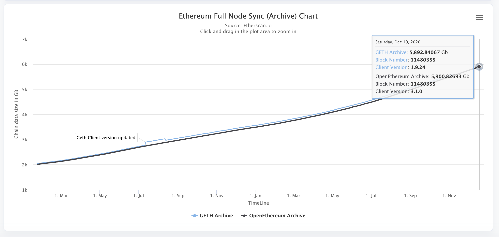
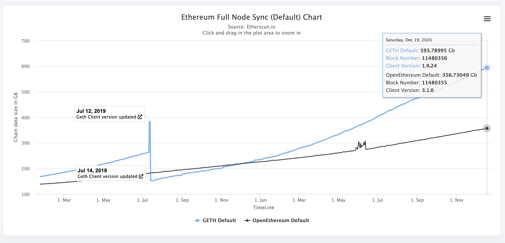

<!--more-->

## 不同语言实现的客户端

推荐使用geth或parity，parity性能会更好一些，而且rpc接口更好用，不过parity看起来不更新了。稳妥一点还是选择geth。

可以查看网站[https://ethstats.net/](https://ethstats.net/)，获取当前活跃的节点以及使用的客户端类型

- [Parity](https://github.com/openethereum/parity-ethereum), written in Rust
- [Geth](https://github.com/ethereum/go-ethereum), written in Go
- [cpp-ethereum](https://github.com/ConsenSysMesh/cpp-ethereum), written in C++
- [pyethereum](https://github.com/ethereum/py-evm), written in Python
- [Mantis](https://github.com/input-output-hk/mantis), written in Scala
- [Harmony](https://github.com/ether-camp/ethereum-harmony), written in Java

## 全节点所需硬件配置

一般情况下，如果我们自建节点，都是选择全节点模式，全节点包含所有的区块以及交易数据。

全节点的硬件配置要求：
- 内存: 16GB+
- 硬盘：Fast SSD with 500GB+
- Fast CPU：4+ cores
- 网速： 25+ MBit/sec 下载速度

最新的统计数据：
- 区块大小：`536.38GB` 
- 区块高度：11,482,281
- TPS：～15
- 难度值：3.632 P
- 算力值：283.091 Thash/s 
- 挖矿收益：0.0432 USD/Day for 1 MHash/s

[https://bitinfocharts.com/ethereum/](https://bitinfocharts.com/ethereum/)


## 使用geth搭建全节点

geth默认使用fast同步方式跳过验证所有的transaction，同步完数据后再进行验证，这样可以更快的同步好数据

### 安装geth
```shell
git clone https://github.com/ethereum/go-ethereum.git
cd go-ethereum
make geth
```

### 查看版本
```shell
➜  go-ethereum git:(master) ./build/bin/geth version
Geth
Version: 1.9.25-unstable
Git Commit: 15339cf1c9af2b1242c2574869fa7afca1096cdf
Git Commit Date: 20201204
Architecture: amd64
Protocol Versions: [65 64 63]
Go Version: go1.15.5
Operating System: darwin
GOPATH=
GOROOT=go
```

### 查看同步模式以及归档模式

#### 同步模式
```shell
$ geth -h | grep sync
--syncmode value                    Blockchain sync mode ("fast", "full", or "light") (default: fast)
```

>  Full
> 同步完整的区块信息，获取所有历史区块的header、body数据，
> 从创始块开始校验每一个元素，并顺序执行其中的所有交易，验证区块头中的 stateRoot、transactionRoot 和 receiptRoot。
>
>  Fast
> 获取所有历史区块的header、body数据，但不执行其中的任何交易，所以也无法验证区块头中的三个状态根。
> 在追上最新区块之后，会继续请求最新的完整 state trie 数据，并维护最新的 state trie 和 receipt trie 数据，但不保存它们的历史版本。
> 所以可以用 fast 模式同步的节点执行智能合约来获得最新的状态。使用此模式时可以设置 --cache，默认1024M
>
>  Light
> 只下载所有区块的header数据，本地仅做交易是否发生的验证，
> 也就是仅下载最新区块的所有数据并验证 transactionRoot 是否一致。无法进行任何状态验证。

```shell
--syncmode fast --cache 2048
```

#### 归档模式
```shell
$ geth -h | grep gcmode
--gcmode value                      Blockchain garbage collection mode ("full", "archive") (default: "full")
```

>  archive 
> 存储着智能合约中的所有值状态以及帐户余额的完整历史记录
>
>  full
> 验证每块的state trie、transaction trie 和 receipt trie数据，但并不保存所有的 state trie、transaction trie 和 receipt trie 的完整历史版本

查看当前archive所需要的硬盘空间[https://etherscan.io/chartsync/chainarchive](https://etherscan.io/chartsync/chainarchive), 可以看到目前使用archive方式需要接近6T的硬盘



查看默认设置的全节点需要的硬盘空间[https://etherscan.io/chartsync/chaindefault](https://etherscan.io/chartsync/chaindefault), ~600G




### 指定目录存放区块数据

默认区块数据会存放在`~/.ethereum`, 如果是挂载了云盘或其他独立硬盘分区，可以使用`--datadir`选项，比如我这里使用了`/mnt/ethereum`

```shell
$ geth --datadir /mnt/ethereum
```

如果是后台运行，使用
```shell
$ nohup geth --datadir /mnt/ethereum &
```

### 如何查看同步进度

```shell
$ geth attach --datadir /mnt/ethereum/
Welcome to the Geth JavaScript console!

instance: Geth/v1.9.20-stable-979fc968/linux-amd64/go1.15
at block: 0 (Thu Jan 01 1970 00:00:00 GMT+0000 (UTC))
 datadir: /mnt/ethereum
 modules: admin:1.0 debug:1.0 eth:1.0 ethash:1.0 miner:1.0 net:1.0 personal:1.0 rpc:1.0 txpool:1.0 web3:1.0

> web3.eth.syncing
{
  currentBlock: 11482973,
  highestBlock: 11483066,
  knownStates: 518211542,
  pulledStates: 517988539,
  startingBlock: 11421036
}
>
```

 可以看到当前同步到的区块高度是`11482973`,而最新的高度是`11483066`，而`knownStates`是`518211542`,我们已经`pulledStates`是`517988539`，只有当`currentBlock == highestBlock` 并且`pulledStates == knownStates`才算同步完成，当你经过很多天的等待都无法同步好时，请首先升级硬盘的iops，推荐用ssd，而不是hdd，并且内存也要相应增加。

也可以查看[源码](https://github.com/ethereum/go-ethereum/blob/3fa0fa713bc1508835bdecd7dea78ff09803e327/interfaces.go#L98)

```go
// SyncProgress gives progress indications when the node is synchronising with
// the Ethereum network.
type SyncProgress struct {
	StartingBlock uint64 // Block number where sync began
	CurrentBlock  uint64 // Current block number where sync is at
	HighestBlock  uint64 // Highest alleged block number in the chain
	PulledStates  uint64 // Number of state trie entries already downloaded
	KnownStates   uint64 // Total number os state trie entries known about
}
```