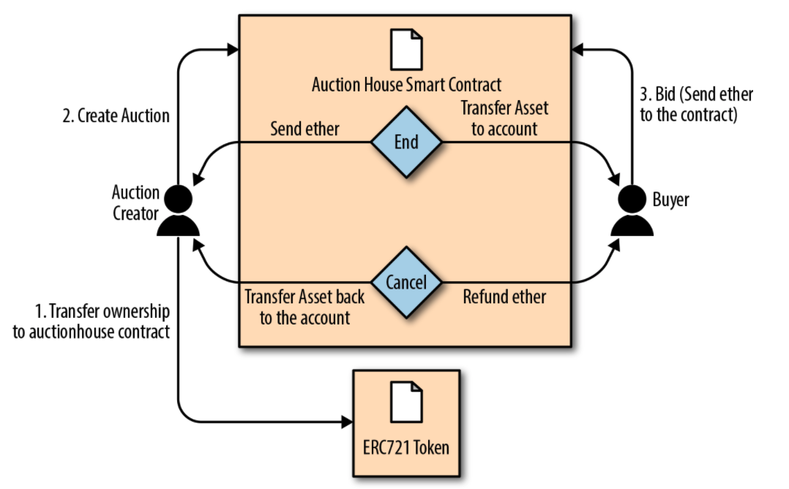

dapps

<!-- more -->

## 如何创建一个真正的 DApp

包括：

- 智能合约
- 前端
- ENS 服务
- 消息通信

## Auction Dapp

拍卖逻辑流程



项目地址：https://github.com/ethereumbook/ethereumbook/tree/develop/code/auction_dapp

### 智能合约

主要是两个合约

https://github.com/ethereumbook/ethereumbook/blob/develop/code/auction_dapp/backend/contracts/DeedRepository.sol

https://github.com/ethereumbook/ethereumbook/blob/develop/code/auction_dapp/backend/contracts/AuctionRepository.sol

#### DeepRepository

ERC721 兼容的 token

#### AuctionRepository

主逻辑合约

### 编译部署合约

```
$ cd code/auction_dapp/backend
$ truffle init
$ truffle compile
$ npm install @truffle/hdwallet-provider
$ truffle migrate --network ropsten
```
