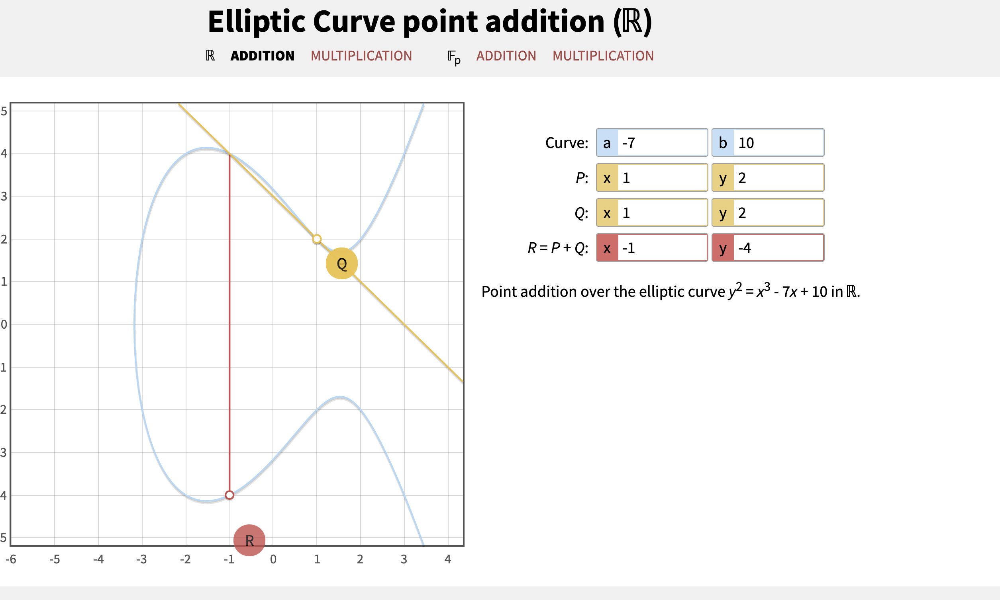
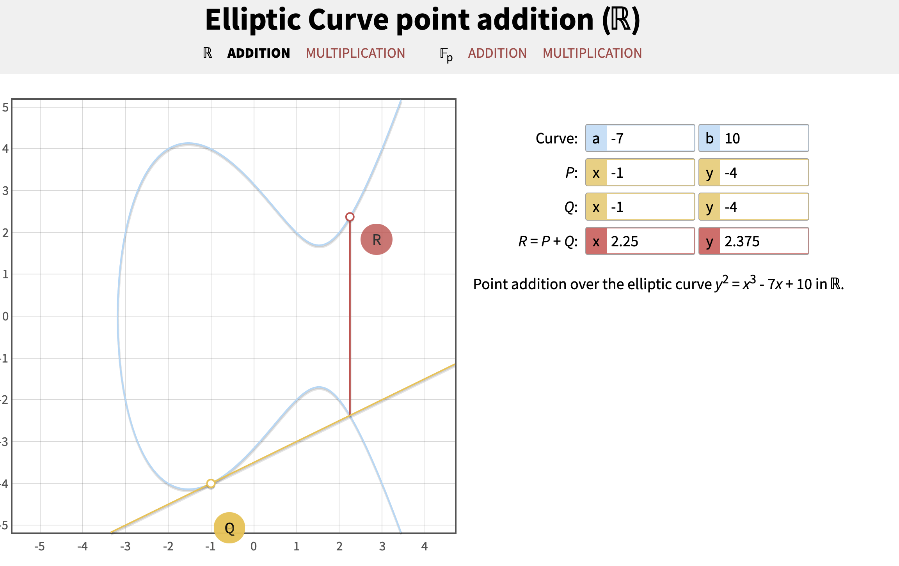

以太坊的加密算法，公私钥生成，椭圆曲线

<!--more-->

## 密码学

区块链的所有数据是公开透明的，并且也没有加密，任何人可以查看链上发生的所有交易。

同时所有的交易也是可以验证的，而链上的数据验证都只需要知道公开的地址，并不需要私钥，这些都是密码学保证的。

## 密钥及地址

我们从私钥到地址的生成过程来梳理一下相关的名词概念。

### 1.私钥生成

通过随机函数生成 256 位的数字，这里你要注意，`一定要使用安全的随机函数，一定要对你所使用的随机函数有充分的认识`。

比如微信小程序就没办法使用安全的随机函数。

私钥一般使用 64 个 16 进制数表示，如下，每一个数字代表了 4 个 bit 位

```
f8f8a2f43c8376ccb0871305060d7b27b0554d2cc72bccf41b2705608452f315
```

### 2.公钥生成

公钥是私钥通过椭圆曲线算法(secp256k1)得到的，具体算法如下

```
K = k * G
```

- K 生成的公钥
- k 就是我们的私钥
- G 是一个常量

注意这里的乘法不是简单的数字相乘，也不能用除法反推私钥，他是不可逆的

这里的乘法我们可以转换成多次的加法，也就是K = G + G + G + ... + G，G相加k次，他的几何意义是G这个点在椭圆曲线上进行k次用切线获取交点的x轴对称点转换。而一次G+G运算，就是G点得到椭圆曲线的切线，并和椭圆曲线相交得到的R'点，然后得到R'的x轴对称点R点。

### 3. 演示

我们通过[https://andrea.corbellini.name/ecc/interactive/reals-add.html](https://andrea.corbellini.name/ecc/interactive/reals-add.html)演示一下

P和Q使用同一点(1,2)，可以得到R的坐标为(-1, -4)



然后我们再用R作为新的P坐标，可以得到R坐标为()



这样不断的循环下去，循环k次，得到最终的坐标点，就是我们的公钥地址坐标点。

例子：

```
K = f8f8a2f43c8376ccb0871305060d7b27b0554d2cc72bccf41b2705608452f315 * G
```

得到的公钥坐标为

```
x = 6e145ccef1033dea239875dd00dfb4fee6e3348b84985c92f103444683bae07b
y = 83b5c38e5e2b0c8529d7fa3f64d46daa1ece2d9ac14cab9477d042c84c32ccd0
```

最终我们的公钥由前缀`04`(uncompressed point) + `x坐标` + `y坐标`组成

```
04 + x-coordinate (32 bytes/64 hex) + y-coordinate (32 bytes/64 hex)
```

```
046e145ccef1033dea239875dd00dfb4fee6e3348b84985c92f103444683bae07b\
83b5c38e5e2b0c8529d7fa3f64d46daa1ece2d9ac14cab9477d042c84c32ccd0
```


### 4.椭圆曲线的公式

$$
y^2 = (x^3 + 7) mod p
$$


mod p的意义是椭圆曲线所有的坐标都在有限域内， p为

$$
p = 2^{256} – 2^{32} – 2^9 – 2^8 – 2^7 – 2^6 – 2^4 – 1
$$

例子坐标点代入公式，使用`irb`测试

```shell
2.6.5 :004 >  p = 2 ** 256 - 2 ** 32 - 2 ** 9 - 2 ** 8 - 2 ** 7 - 2 ** 6 - 2 ** 4 - 1
 => 115792089237316195423570985008687907853269984665640564039457584007908834671663
2.6.5 :005 > x = 49790390825249384486033144355916864607616083520101638681403973749255924539515
 => 49790390825249384486033144355916864607616083520101638681403973749255924539515
2.6.5 :006 > y = 59574132161899900045862086493921015780032175291755807399284007721050341297360
 => 59574132161899900045862086493921015780032175291755807399284007721050341297360
2.6.5 :007 > (x ** 3 + 7 - y**2) % p
 => 0
```

###  5. 地址生成

之前得到的公钥地址，可以通hash算法将长度缩短，并且无法反推，这里我们要看下hash算法的特点

- *Determinism*: A given input message always produces the same hash output.
- *Verifiability*：Computing the hash of a message is efficient (linear complexity).
- *Noncorrelation*：A small change to the message (e.g., a 1-bit change) should change the hash output so extensively that it cannot be correlated to the hash of the original message.
- *Irreversibility*： Computing the message from its hash is infeasible, equivalent to a brute-force search through all possible messages.
- *Collision protection*：It should be infeasible to calculate two different messages that produce the same hash output.

hash算法的用途有：

- Data fingerprinting
- Message integrity (error detection)
- Proof of work
- Authentication (password hashing and key stretching)
- Pseudorandom number generators
- Message commitment (commit–reveal mechanisms)
- Unique identifiers

以太坊使用的hash算法是: `Keccak-256`,是修复过安全漏洞的，可以通过对空字符串hash判断是否用的修复过的算法

```
Keccak256("") =
  c5d2460186f7233c927e7db2dcc703c0e500b653ca82273b7bfad8045d85a470 # 修复过的

SHA3("") =
  a7ffc6f8bf1ed76651c14756a061d662f580ff4de43b49fa82d80a4b80f8434a
```

对于上面的例子中得到的公钥

```
046e145ccef1033dea239875dd00dfb4fee6e3348b84985c92f103444683bae07b\
83b5c38e5e2b0c8529d7fa3f64d46daa1ece2d9ac14cab9477d042c84c32ccd0
```

注意：生成地址的时候我们不使用`0x04`前缀

对其hash后得到

```ruby
const keccak256 = require('keccak256')

console.log(keccak256('0x6e145ccef1033dea239875dd00dfb4fee6e3348b84985c92f103444683bae07b83b5c38e5e2b0c8529d7fa3f64d46daa1ece2d9ac14cab9477d042c84c32ccd0').toString('hex'))

2a5bc342ed616b5ba5732269001d3f1ef827552ae1114027bd3ecf1f086ba0f9
```

然后只取最后的20个字节作为最终的地址，因为是16进制显示的，一个字符代表4个bit，所以需要40个字符

```
001d3f1ef827552ae1114027bd3ecf1f086ba0f9
```

加上前缀`0x`

```
0x001d3f1ef827552ae1114027bd3ecf1f086ba0f9
```


## 使用代码演示从私钥到公钥及地址的过程

ruby例子：

```ruby
require 'openssl'
require 'base16'
require 'digest/sha3'
def eth_address(public_key)
  s = public_key[2, 128]
  s.downcase!
  s = Base16.decode16(s)
  h = Digest::SHA3.hexdigest(s, 256)
  a = '0x' + h[-40..-1]
  return a
end
ec = OpenSSL::PKey::EC.new('secp256k1')
ec.generate_key
public_key = ec.public_key.to_bn.to_s(16)
private_key = ec.private_key.to_s(16)
eth_address = eth_address(public_key)
puts "address: #{eth_address}"
puts "private_key: #{private_key}"
puts "public_key: #{public_key}"
```

运行:

```shell
➜  ecc git:(master) ✗ ruby generate_private_key_and_address.rb
address: 0xb1e97939c2942d209b077e5e253eec7b1eb58a7c
private_key: 7CC979D685A6D90A4DD618C524BC71BE11F234B65B0FCD562ED5051DCAD76052
public_key: 04F9EC4283DD66748B616B0471CE49B29F83016E7D330E74A49B7AA9920232498DA45A2BB4320694D889EA87EE3FDA4464C63140217A0DF46A1139B41BA9FE70EA
```

js例子：

```
const EthCrypto = require('eth-crypto');
const identity = EthCrypto.createIdentity();
console.dir(identity);
```

运行:

```shell
➜  ecc git:(master) ✗ node generate_private_key_and_address.js
{
  address: '0x07f9eEbB50D44887C39d65C58fD68aBe34e6719e',
  privateKey: '0x82c0e50caa370abcf93d71e5aa96dc8f106bd5722903d3d89a4934fcc0d80b99',
  publicKey: '272eeebcc2ddfc1da82f6707dc2c048d04b499de0883f6f1895769836c0b50749002d78c292c3eaaecc7e253ec1381e6d5b1c026cbbc37dfd8a9af5c78a70b26'
}
```


## 可验证正确性的地址

以太坊的地址本身没有`CheckSum`，也不区分大小写，为了增加安全性，[EIP-55](https://github.com/Ethereum/EIPs/blob/master/EIPS/eip-55.md)提出了如何使用大小写敏感的地址格式来验证其正确性

具体步骤如下：

### 1. 对小写的地址进行hash

```
Keccak256("001d3f1ef827552ae1114027bd3ecf1f086ba0f9") =
23a69c1653e4ebbb619b0b2cb8a9bad49892a8b9695d9a19d8f673ca991deae1
```

### 2. 得到的hash值和原小写地址进行一一对比

```
Address: 001d3f1ef827552ae1114027bd3ecf1f086ba0f9
Hash   : 23a69c1653e4ebbb619b0b2cb8a9bad49892a8b9...
```

每一个地址中的字母，如果hash对应的值大小`>=0x8`，则应该为大写

比如第四个是字母`d`，但对应的是`6`，所以小写

第六个字母是`f`，对应的是`c`，所以大写

最终得到的是

```
Address: 001d3F1ef827552Ae1114027BD3ECF1f086bA0F9
Hash   : 23a69c1653e4ebbb619b0b2cb8a9bad49892a8b9...
```

而一旦我们没有使用正确的地址格式，我们对其hash后，再进行验证就会出错

可使用[https://github.com/miguelmota/ethereum-checksum-address](https://github.com/miguelmota/ethereum-checksum-address)测试，web3也有相应的方法