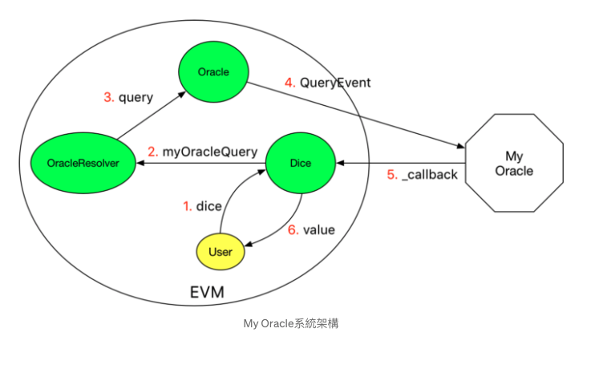

oracles

<!-- more -->

### 概念

oracle，源自于希腊神话，代表可以预知未来，所以很多人也把他称为以太坊的预言机。
以太坊的 oracle 用于获取外部数据（非链上）。

### EVM 的特点

- 不能生成真正的随机数
  - 智能合约不能每次执行结果都不一样，无法达成共识
  - 博彩游戏会有作弊风险
- 外部的数据只能放在 transaction 的 data payload

### 使用场景

- 球赛比分
- 黄金价格
- 随机数生成
- 总统选举结果
- 天气数据
- 地震监测数据

### 设计模式

- 链下获取数据
  - 可以只存放数据的 hash，而不用所有的细节
- 签名上链
- 存入智能合约

## 实例

### Ref:

https://medium.com/taipei-ethereum-meetup/oracle%E7%B3%BB%E5%88%97%E4%B8%80-human-oracle-cb7ed8268030

https://medium.com/taipei-ethereum-meetup/oracle%E7%B3%BB%E5%88%97%E4%BA%8C-my-oracle-d86ea6971431
