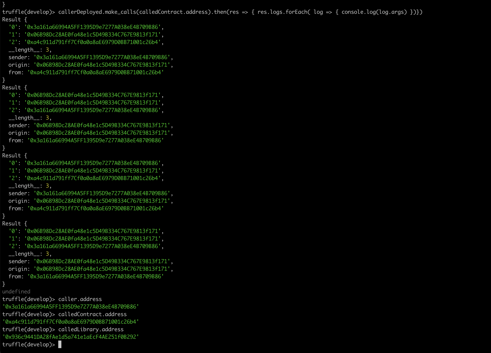

smart contract solidity

<!--more-->

## What is Smart Contract

In the 1990s, cryptographer Nick Szabo coined the term and defined it as “**a set of promises, specified in digital form, including protocols within which the parties perform on the other promises.**"

In ethereum,use **immutable computer programs that run deterministically in the context of an Ethereum Virtual Machine as part of the Ethereum network protocol**

## Life Cycle of a Smart Contract

- _called by a transaction_
- call another contract
- no parallel and single-threaded
- _atomic_
- cannot be changed. However, a contract can be “deleted”

## Solidity

- imperative language: Imperative programming, by contrast, is where a programmer writes a set of procedures that combine the logic and flow of a program

- created by Dr. Gavin Wood

[https://docs.soliditylang.org/en/v0.7.4/](https://docs.soliditylang.org/en/v0.7.4/)

## Install Solidity Compiler

[install solidity](https://docs.soliditylang.org/en/latest/installing-solidity.html)

### Check current solc version

```shell
$ solc --version
solc, the solidity compiler commandline interface
Version: 0.7.5+commit.eb77ed08.Darwin.appleclang
```

## Simple Solidity Program

[https://github.com/ethereumbook/ethereumbook/blob/develop/code/Solidity/Faucet.sol](https://github.com/ethereumbook/ethereumbook/blob/develop/code/Solidity/Faucet.sol)

### compile

```shell
✗ solc --optimize --bin Faucet.sol
Error: Source file requires different compiler version (current compiler is 0.7.5+commit.eb77ed08.Darwin.appleclang) - note that nightly builds are considered to be strictly less than the released version
 --> Faucet.sol:2:1:
  |
2 | pragma solidity ^0.6.0;
  | ^^^^^^^^^^^^^^^^^^^^^^^
```

### resolve version issue

`pragma solidity ^0.6.0` means `this program can be compiled by a Solidity compiler with a minimum version of 0.6.0`,that means you can use `0.6.x` but not `0.7.x`.

Our current version is `0.7.5`, So we need to modify the first line as:

```
pragma solidity ^0.7.0;
```

### compile again

```shell
✗ solc --optimize --bin Faucet.sol
Warning: SPDX license identifier not provided in source file. Before publishing, consider adding a comment containing "SPDX-License-Identifier: <SPDX-License>" to each source file. Use "SPDX-License-Identifier: UNLICENSED" for non-open-source code. Please see https://spdx.org for more information.
--> Faucet.sol


======= Faucet.sol:Faucet =======
Binary:
608060405234801561001057600080fd5b5060cc8061001f6000396000f3fe608060405260043610601f5760003560e01c80632e1a7d4d14602a576025565b36602557005b600080fd5b348015603557600080fd5b50605060048036036020811015604a57600080fd5b50356052565b005b67016345785d8a0000811115606657600080fd5b604051339082156108fc029083906000818181858888f193505050501580156092573d6000803e3d6000fd5b505056fea2646970667358221220aeb8ae5bf7323de1c04cf037f9612e67a487fbc2d44df50efcc65d22a49f52ba64736f6c63430007050033
```

Add `SPDX-License-Identifier: UNLICENSED` to the head of file to resolve the compiler's warning

### get abi

```shell
✗ solc --abi Faucet.sol

======= Faucet.sol:Faucet =======
Contract JSON ABI
[{"inputs":[{"internalType":"uint256","name":"withdraw_amount","type":"uint256"}],"name":"withdraw","outputs":[],"stateMutability":"nonpayable","type":"function"},{"stateMutability":"payable","type":"receive"}]
```

## Get transaction info by infura

```shell
$ curl https://ropsten.infura.io/v3/YOUR-PROJECT-ID \
>     -X POST \
>     -H "Content-Type: application/json" \
>     -d '{"jsonrpc":"2.0","method":"eth_getTransactionByHash","params": ["0xf874eb0fb2fdcd10842ebe787d2a18f9a2bf3d51c575d6be434c90692de148c4"],"id":1}'     | jq
  % Total    % Received % Xferd  Average Speed   Time    Time     Time  Current
                                 Dload  Upload   Total   Spent    Left  Speed
100  1749  100  1608  100   141   1574    138  0:00:01  0:00:01 --:--:--  1714
{
  "jsonrpc": "2.0",
  "id": 1,
  "result": {
    "blockHash": "0x3f5c606ff44ccba84bcf2b1317de67bd93540079812c0ff9ca438098bb4fc4c4",
    "blockNumber": "0x90e933",
    "from": "0xa45e280704b00547cd5aaab4b41c722e83f2d4b8",
    "gas": "0x293d9",
    "gasPrice": "0x796b6cb0",
    "hash": "0xf874eb0fb2fdcd10842ebe787d2a18f9a2bf3d51c575d6be434c90692de148c4",
    "input": "0x608060405234801561001057600080fd5b50336000806101000a81548173ffffffffffffffffffffffffffffffffffffffff021916908373ffffffffffffffffffffffffffffffffffffffff1602179055506101b4806100606000396000f30060806040526004361061004c576000357c0100000000000000000000000000000000000000000000000000000000900463ffffffff1680632e1a7d4d1461004e57806383197ef01461007b575b005b34801561005a57600080fd5b5061007960048036038101908080359060200190929190505050610092565b005b34801561008757600080fd5b506100906100f3565b005b67016345785d8a000081111515156100a957600080fd5b3373ffffffffffffffffffffffffffffffffffffffff166108fc829081150290604051600060405180830381858888f193505050501580156100ef573d6000803e3d6000fd5b5050565b6000809054906101000a900473ffffffffffffffffffffffffffffffffffffffff1673ffffffffffffffffffffffffffffffffffffffff163373ffffffffffffffffffffffffffffffffffffffff1614151561014e57600080fd5b6000809054906101000a900473ffffffffffffffffffffffffffffffffffffffff1673ffffffffffffffffffffffffffffffffffffffff16ff00a165627a7a723058205b98d5a5f31718cedc350e073766fe06d69f4628bc6232947f1521f28162c8ac0029",
    "nonce": "0x1e",
    "r": "0x99c226063cf95c7329f64401252168bd45ba6b1b67c3d47011aab3c6b9ac94f8",
    "s": "0x6ac17565e15d0615d4e722b3b4d50022fa39f0a704fe09451adc392a6811d670",
    "to": null,
    "transactionIndex": "0x18",
    "v": "0x29",
    "value": "0x0"
  }
}
```

## Install truffle

```shell
npm install -g truffle
✗ truffle version
Truffle v5.1.56 (core: 5.1.56)
Solidity v0.5.16 (solc-js)
Node v15.3.0
Web3.js v1.2.9
```

## Call other contracts

- Creating a new instance
- Addressing an existing instance
- Raw call, delegatecall

whereas a call changes the value of msg.sender to be the calling contract, a delegatecall keeps the same msg.sender as in the calling contract.

```javascript
pragma solidity ^0.5.16;

contract calledContract {
    event callEvent(address sender, address origin, address from);

    function calledFunction() public {
        emit callEvent(msg.sender, tx.origin, address(this));
    }
}

library calledLibrary {
    event callEvent(address sender, address origin, address from);

    function calledFunction() public {
        emit callEvent(msg.sender, tx.origin, address(this));
    }
}

contract caller {
    function make_calls(calledContract _calledContract) public {
        // Calling calledContract and calledLibrary directly
        _calledContract.calledFunction();
        calledLibrary.calledFunction();

        // Low-level calls using the address object for calledContract
        address(_calledContract).call(
            abi.encodeWithSignature("calledFunction()")
        );
        address(_calledContract).delegatecall(
            abi.encodeWithSignature("calledFunction()")
        );
    }
}

```



## Gas Considerations

- #### Avoid Dynamically Sized Arrays

- #### Avoid Calls to Other Contracts (don't agree this)

## Estimating Gas Cost

- call estimateGas function
- hard code maybe a easier way
