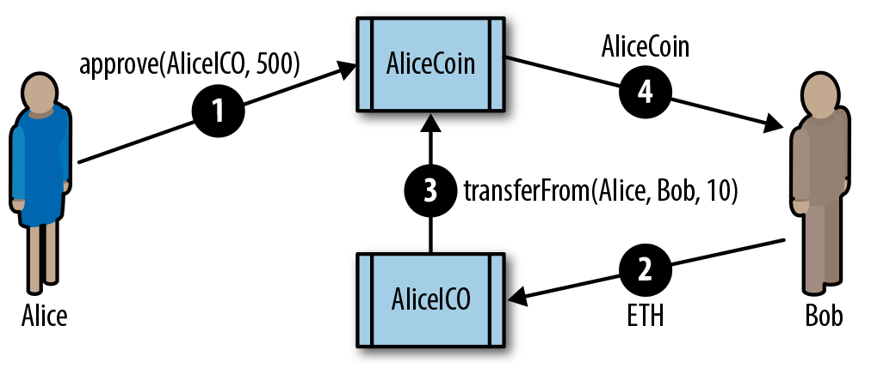

tokens

<!--more-->

## 定义

以太坊的 token，圈内一般叫代币，通证。

## 用途

- 货币
- 资源
- 资产
- 权利
- 产权
- 投票
- 收藏品
- 数字身份
- 证明
- 工具

## Fungibility

可替代性，比如有 100 个 CRO，每一个 CRO 都是一样的价值。(ERC20)

不可替代性， CryptoKitty 的每一只猫都是不同的，每一只猫对应了一个 token。(ERC721)


## Intrinsicality

只要不和现实生活中的资产联系起来，链上资产是完全属于私钥拥有者的。

## ICO

 *Initial Coin Offering* (ICO) 

正是因为以太坊提供了方便的token发行机制，相比于传统的股票上市，流程和规则都比较简单，一些技术革新者可以很好的使用这个工具来获取初始资金，对于投资者也降低了门槛。所以2017年的ICO非常的火爆，但很多项目方都是借着这股浪潮进行非法资金众筹，导致很多投资者损失惨重，所以后面的国家管制也就随之而来。

而一个初创项目的风险其实很多：

- 以太坊链的风险，比如发生51%攻击
- 交易所的风险，流动性不足
- 监管的风险
- 智能合约的风险，比如发生漏洞攻击

### Uniswap

以前的token是没有价值保证的，完全依赖项目方或者上到中心化交易所去交易，而且不同的token也很难互换。但自从有了uniswap，token本身就有了价格，并且可以通过uniswap的pair进行互换，这大大的增强了token的价值。所以2020年的defi带来了新的热点。

## 以太坊的token

相比于之前复杂的发币流程，以太坊将其简化，并形成规范，

### ERC20

- Ethereum Request for Comments (ERC), 20(Github issue number20)
- fungible token

interface

```javascript
contract ERC20 {
   function totalSupply() constant returns (uint theTotalSupply);
   function balanceOf(address _owner) constant returns (uint balance);
   function transfer(address _to, uint _value) returns (bool success);
   function transferFrom(address _from, address _to, uint _value) returns
      (bool success);
   function approve(address _spender, uint _value) returns (bool success);
   function allowance(address _owner, address _spender) constant returns
      (uint remaining);
   event Transfer(address indexed _from, address indexed _to, uint _value);
   event Approval(address indexed _owner, address indexed _spender, uint _value);
}
```

​	

```
mapping (address => mapping (address => uint256)) public allowed;
```

这里的二级map，第一级是owner地址，第二级是spender地址


两种转币的方法：

- transfer: single-transaction, straightforward workflow using the transfer function. This workflow is the one used by wallets to send tokens to other wallets. 
- approve & transferFrom: a two-transaction workflow that uses approve followed by transferFrom.This workflow allows a token owner to delegate their control to another address. It is most often used to delegate control to a contract for distribution of tokens, but it can also be used by exchanges.

approve方法并没有真正的转移token，相当于是授权，当真正调用transferFrom的时候，如果balance不足是会失败的



注意这里的交互方式是，Alice调用AliceCoin合约的approve方法给AliceICO合约授权500数量的allowance，Bob转ETH到AliceICO合约后，AliceICO合约调用AliceCoin的transferFrom方法，从Alice地址转了10个AliceCoin给Bob

- [简单的ERC20实现](https://github.com/ConsenSys/Tokens/blob/master/contracts/eip20/EIP20.sol)
- [openzeppelin的ERC20实现](https://github.com/OpenZeppelin/openzeppelin-contracts/blob/v1.12.0/contracts/token/ERC20/StandardToken.sol): 增加安全检查

## 开发部署自己的ERC20 Token

### 安装truffle

```shell
npm install -g truffle
✗ truffle version
Truffle v5.1.56 (core: 5.1.56)
Solidity v0.5.16 (solc-js)
Node v15.3.0
Web3.js v1.2.9
```

### 新建项目

```shell
$ mkdir METoken
$ cd METoken
METoken $ truffle init
METoken $ npm init
```

### 修改配置文件truffle-config.js

直接使用[https://github.com/ethereumbook/ethereumbook/blob/develop/code/truffle/METoken/truffle-config.js](https://github.com/ethereumbook/ethereumbook/blob/develop/code/truffle/METoken/truffle-config.js)

创建.env文件，填写私钥

### 安装openzeppelin库

```shell
npm install openzeppelin-solidity@1.12.0
```

### 安装其他依赖库

```
npm install dotenv
npm install web3
npm install truffle-wallet-provider
```

## Issues with ERC20 Tokens

- ether交易，recipient address就是收款地址，而token交易的recipient address是contract address
- ether交易，改变的是recipient address的state，而token交易改变的是contract的state
- 对于钱包，只有添加了token contract才能看到余额信息
- ether使用send函数，以及payable函数进行交易，token使用transfer或者approve&transferFrom函数交易，不会触发payable函数
- 每笔交易都要消耗ether作为gas

## ERC223

判断地址是否是合约地址

```javascript
function isContract(address _addr) private view returns (bool is_contract) {
  uint length;
    assembly {
       // retrieve the size of the code on target address; this needs assembly
       length := extcodesize(_addr)
    }
    return (length>0);
}
```

extcodesize可以获取地址的代码行数：https://ethereum.stackexchange.com/questions/15641/how-does-a-contract-find-out-if-another-address-is-a-contract

## ERC777

## ERC721

https://etherscan.io/tokens-nft

## Resources

https://hardhat.org/

https://www.trufflesuite.com/docs

https://github.com/OpenZeppelin/openzeppelin-contracts

https://docs.openzeppelin.com/learn/setting-up-a-node-project

https://etherscan.io/token/0x06012c8cf97bead5deae237070f9587f8e7a266d

https://etherscan.io/tokens


