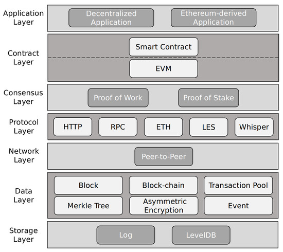
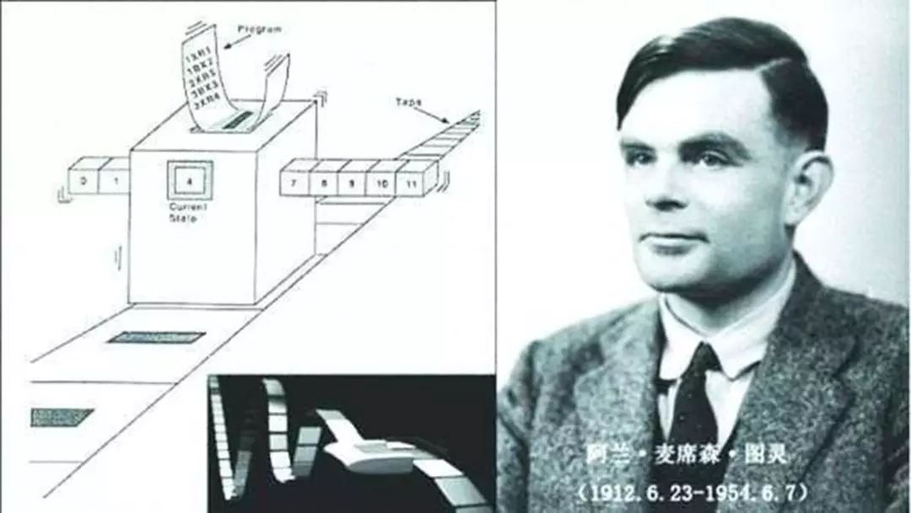
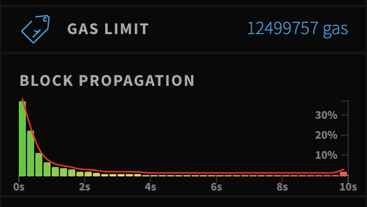

以太坊的历史，定义，以及组件

<!--more-->

## 什么是以太坊？

简单来说，以太坊就是一个可以执行智能合约来进行数据修改及存储的去中心化网络平台。

## 以太坊的由来

作者 Vitalik Buterin(人称 v 神)，为了扩展 bitcoin 的功能，但得不到 bitcoin 团队的支持，从而决定重新开发一条新的区块链。
还有一个重要成员是 Gavin Wood(波卡链的创始人)，为以太坊的联合创始人以及 CTO，提出了`web3`的概念。

以太坊的第一个区块为[https://etherscan.io/block/0](https://etherscan.io/block/0)，时间为 2015 年 7 月 30 日

## 以太坊的四个开发阶段

这四个大版本升级是不向后兼容的，分别是 `Frontier`, `Homestead`, `Metropolis`, and `Serenity`.

以及中间过程中产生的硬分叉版本，分别是`Ice Age`, `DAO`, `Tangerine Whistle`, `Spurious Dragon`, `Byzantium`, and `Constantinople`.

这些版本都表现在编写智能合约时候编译器版本以及虚拟机版本的选择上。

截止本文目前的最新区块高度为: `11436806`,正在经历的是 [eth2.0](https://ethereum.org/en/eth2/).

## 以太坊的架构



## 什么是图灵完备(Turing Completeness)

以太坊总是拿来和比特币对比，其中就是这个图灵完备的概念

首先我们要知道图灵机，图灵机是 1936 年，Alan Turing 提出的数学模型。形象地来说，它就像是老式的电传机：一个读写头，一根纸带（可能任意长），读写头不断读取纸带上的符号，并根据内在的状态转换规则转换当前状态，同时进行一些动作，比如擦除或改写当前字符，向前/向后移动读写头或保持不动等。



然后他又提出图灵完备的概念，即如果一个系统能模拟出任意的图灵机，这个系统就是图灵完备的，这个系统也被称为`Universal Turing machine (UTM)`.

个人理解就是以太坊说比特币不是图灵完备，就是以太坊可以执行无限循环语句，从而构造复杂的程序，而比特币不行。

### 直观理解图灵完备——Brainfuck 语言

一共支持 8 种指令

| Command |                             Description                             |
| :-----: | :-----------------------------------------------------------------: |
|   `>`   |                    Move the pointer to the right                    |
|   `<`   |                    Move the pointer to the left                     |
|   `+`   |              Increment the memory cell at the pointer               |
|   `-`   |              Decrement the memory cell at the pointer               |
|   `.`   |      Output the character signified by the cell at the pointer      |
|   `,`   |      Input a character and store it in the cell at the pointer      |
|   `[`   |     Jump past the matching `]` if the cell at the pointer is 0      |
|   `]`   | Jump back to the matching `[` if the cell at the pointer is nonzero |

输出`Hello World!`

```c
 1 ++++++++               Set Cell #0 to 8
 The result of this is:
 Cell No :   0   1   2   3   4   5   6   7
 Contents:   8   0   0   0   0   0   0   0
 Pointer :   ^
 2 [
 3     >++++               Add 4 to Cell #1; this will always set Cell #1 to 4
 The result of this is:
 Cell No :   0   1   2   3   4   5   6   7
 Contents:   8   4   0   0   0   0   0   0
 Pointer :       ^
 4     [                   as the cell will be cleared by the loop
 5         >++             Add 4*2 to Cell #2
 The result of this is:
 Cell No :   0   1   2   3   4   5   6   7
 Contents:   8   4   2   0   0   0   0   0
 Pointer :           ^
 6         >+++            Add 4*3 to Cell #3
 The result of this is:
 Cell No :   0   1   2   3   4   5   6   7
 Contents:   8   4   2   3   0   0   0   0
 Pointer :               ^
 7         >+++            Add 4*3 to Cell #4
 The result of this is:
 Cell No :   0   1   2   3   4   5   6   7
 Contents:   8   4   2   3   3   0   0   0
 Pointer :                   ^
 8         >+              Add 4 to Cell #5
 The result of this is:
 Cell No :   0   1   2   3   4   5   6   7
 Contents:   8   4   2   3   3   1   0   0
 Pointer :                       ^
 9         <<<<-           Decrement the loop counter in Cell #1
 The result of this is:
 Cell No :   0   1   2   3   4   5   6   7
 Contents:   8   3   2   3   3   1   0   0
 Pointer :       ^
10     ]                   Loop till Cell #1 is zero
 The result of this is:
 Cell No :   0   1   2   3   4   5   6   7
 Contents:   8   0   8   12  12  4   0   0
 Pointer :       ^
11     >+                  Add 1 to Cell #2
 The result of this is:
 Cell No :   0   1   2   3   4   5   6   7
 Contents:   8   0   9   12  12  4   0   0
 Pointer :           ^
12     >+                  Add 1 to Cell #3
 The result of this is:
 Cell No :   0   1   2   3   4   5   6   7
 Contents:   8   0   9   13  12  4   0   0
 Pointer :               ^
13     >-                  Subtract 1 from Cell #4
 The result of this is:
 Cell No :   0   1   2   3   4   5   6   7
 Contents:   8   0   9   13  11  4   0   0
 Pointer :                   ^
14     >>+                 Add 1 to Cell #6
 The result of this is:
 Cell No :   0   1   2   3   4   5   6   7
 Contents:   8   0   9   13  11  4   1   0
 Pointer :                           ^
15     [<]                 Move back to the first zero cell you find; this will
16                         be Cell #1 which was cleared by the previous loop
 The result of this is:
 Cell No :   0   1   2   3   4   5   6   7
 Contents:   8   0   9   13  11  4   1   0
 Pointer :       ^
17     <-                  Decrement the loop Counter in Cell #0
 The result of this is:
 Cell No :   0   1   2   3   4   5   6   7
 Contents:   7   0   9   13  11  4   1   0
 Pointer :   ^
18 ]                       Loop till Cell #0 is zero
19
20 The result of this is:
21 Cell No :   0   1   2   3   4   5   6
22 Contents:   0   0  72 104  88  32   8
23 Pointer :   ^
24
25 >>.                     Cell #2 has value 72 which is 'H'
26 >---.                   Subtract 3 from Cell #3 to get 101 which is 'e'
27 +++++ ++..+++.          Likewise for 'llo' from Cell #3
28 >>.                     Cell #5 is 32 for the space
29 <-.                     Subtract 1 from Cell #4 for 87 to give a 'W'
30 <.                      Cell #3 was set to 'o' from the end of 'Hello'
31 +++.----- -.----- ---.  Cell #3 for 'rl' and 'd'
32 >>+.                    Add 1 to Cell #5 gives us an exclamation point
33 >++.                    And finally a newline from Cell #6
```

实现了此语法的[c++版本](https://github.com/JohnCGriffin/BrainForked/)

```shell
➜  BrainForked git:(master) ✗ echo "++++++++[>++++[>++>+++>+++>+<<<<-]>+>+>->>+[<]<-]>>.>---.+++++++..+++.>>.<-.<.+++.------.--------.>>+.>++." | ./bf
Hello World!
```

### 图灵完备的问题

如果能执行任意复杂的程序，可能会造成死循环或消耗大量资源的程序以至于卡住整条链的打包出块，所以以太坊增加了 gas limit 的设定，并且每条指令都会消耗 gas，直到消耗完设定的 gas limit，而 gas limit 的最大值目前是～ 12,500,000, [https://ethstats.net/](https://ethstats.net/)



## 激进的以太坊开发文化

相比 bitcoin 社区的谨慎，以太坊更愿意打破旧有，快速更新，甚至牺牲兼容性。当然这样的后果是生态建设者不得不更新已有的应用，甚至需要重新部署已有的合约。

## 为什么要学习以太坊

区块链融合了编程，密码学，经济学，分布式系统，p2p 网络等知识，而使用以太坊我们可以直接在上层进行应用开发，随着以太坊上的生态逐渐健全，可以组合出更多有趣的项目，比如目前火热的 defi 生态，则是整个平台的项目能够像 lego 积木一样堆叠出了一个庞大的生态体系。
