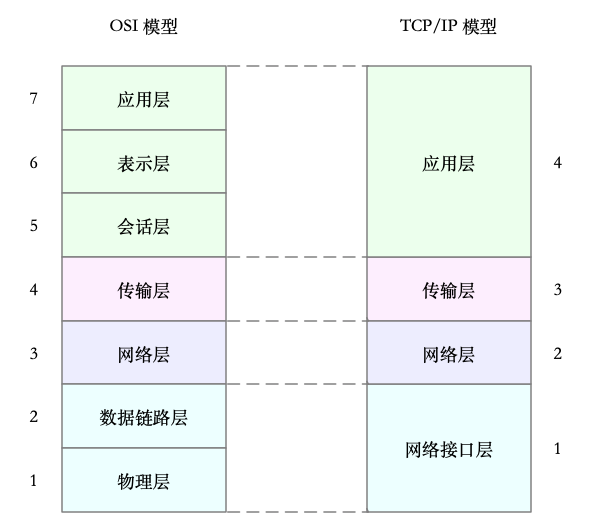

开放式系统互联通信参考模型（Open System Interconnection Reference Model），简称为 OSI 网络模型

<!--more-->

## 七层模型：

- 应用层，负责为应用程序提供统一的接口。
- 表示层，负责把数据转换成兼容接收系统的格式。
- 会话层，负责维护计算机之间的通信连接。
- 传输层，负责为数据加上传输表头，形成数据包。
- 网络层，负责数据的路由和转发。
- 数据链路层，负责 MAC 寻址、错误侦测和改错。
- 物理层，负责在物理网络中传输数据帧。

## 按照简化后的四层模型：

- 应用层，负责向用户提供一组应用程序，比如 HTTP、FTP、DNS 等。
- 传输层，负责端到端的通信，比如 TCP、UDP 等。
- 网络层，负责网络包的封装、寻址和路由，比如 IP、ICMP 等。
- 网络接口层，负责网络包在物理网络中的传输，比如 MAC 寻址、错误侦测以及通过网卡传输网络帧等。

## 网络包接受流程：

- 在链路层检查报文的合法性，找出上层协议的类型（比如 IPv4 还是 IPv6），再去掉帧头、帧尾，然后交给网络层。
- 网络层取出 IP 头，判断网络包下一步的走向，比如是交给上层处理还是转发。当网络层确认这个包是要发送到本机后，就会取出上层协议的类型（比如 TCP 还是 UDP），去掉 IP 头，再交给传输层处理。
- 传输层取出 TCP 头或者 UDP 头后，根据 < 源 IP、源端口、目的 IP、目的端口 > 四元组作为标识，找出对应的 Socket，并把数据拷贝到 Socket 的接收缓存中。
- 最后，应用程序就可以使用 Socket 接口，读取到新接收到的数据了。

