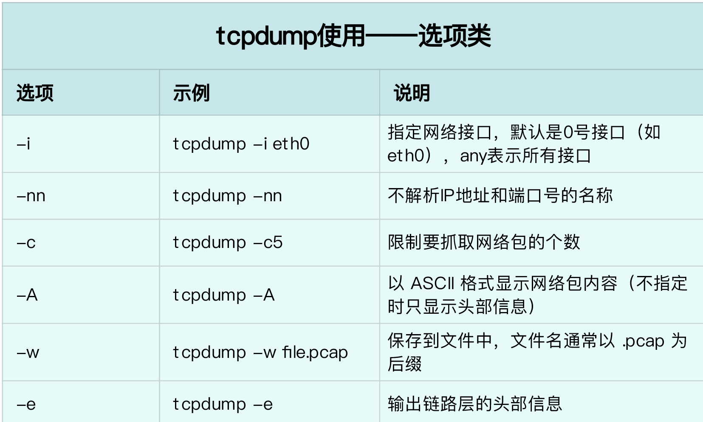

tcpdump 配合 wireshark，可以轻松分析网络包

<!--more-->

## 分析 DNS

在一个终端监听

```shell
$ tcpdump -nn udp port 53 or host 35.190.27.188
tcpdump: data link type PKTAP
tcpdump: verbose output suppressed, use -v or -vv for full protocol decode
listening on pktap, link-type PKTAP (Apple DLT_PKTAP), capture size 262144 bytes
23:03:31.904433 IP 192.168.0.135 > 35.190.27.188: ICMP echo request, id 60170, seq 0, length 64
23:03:31.924609 IP 35.190.27.188 > 192.168.0.135: ICMP echo reply, id 60170, seq 0, length 64
23:03:32.908927 IP 192.168.0.135 > 35.190.27.188: ICMP echo request, id 60170, seq 1, length 64
23:03:33.912916 IP 192.168.0.135 > 35.190.27.188: ICMP echo request, id 60170, seq 2, length 64
23:03:33.948722 IP 35.190.27.188 > 192.168.0.135: ICMP echo reply, id 60170, seq 2, length 64
```

另一个终端执行

```shell
$ ping -c3 geektime.org
PING geektime.org (35.190.27.188): 56 data bytes
64 bytes from 35.190.27.188: icmp_seq=0 ttl=116 time=20.217 ms
Request timeout for icmp_seq 1
64 bytes from 35.190.27.188: icmp_seq=2 ttl=116 time=35.971 ms

--- geektime.org ping statistics ---
3 packets transmitted, 2 packets received, 33.3% packet loss
round-trip min/avg/max/stddev = 20.217/28.094/35.971/7.877 ms
```

tcpdump 选项：

- -nn ，表示不解析抓包中的域名（即不反向解析）、协议以及端口号。
- udp port 53 ，表示只显示 UDP 协议的端口号（包括源端口和目的端口）为 53 的包。
- host 35.190.27.188 ，表示只显示 IP 地址（包括源地址和目的地址）为 35.190.27.188 的包。
- 这两个过滤条件中间的“ or ”，表示或的关系，也就是说，只要满足上面两个条件中的任一个，就可以展示出来。

输出格式为：

- 时间戳
- 协议
- 源地址.源端口 > 目的地址.目的端口
- 网络包详细信息

包解析：

```
23:03:31.904433 IP 192.168.0.135 > 35.190.27.188: ICMP echo request, id 60170, seq 0, length 64
23:03:31.924609 IP 35.190.27.188 > 192.168.0.135: ICMP echo reply, id 60170, seq 0, length 64
23:03:32.908927 IP 192.168.0.135 > 35.190.27.188: ICMP echo request, id 60170, seq 1, length 64
23:03:33.912916 IP 192.168.0.135 > 35.190.27.188: ICMP echo request, id 60170, seq 2, length 64
23:03:33.948722 IP 35.190.27.188 > 192.168.0.135: ICMP echo reply, id 60170, seq 2, length 64
```

可以看出 `seq 0`和`seq 2`都有`reply`, `seq 1`没有`reply`，所以是`packet loss`

## 输出 wireshark 可以解析的文件

```shell
$ tcpdump -nn tcp port 8080 -w nginx.pcap
```

## 常用选项




