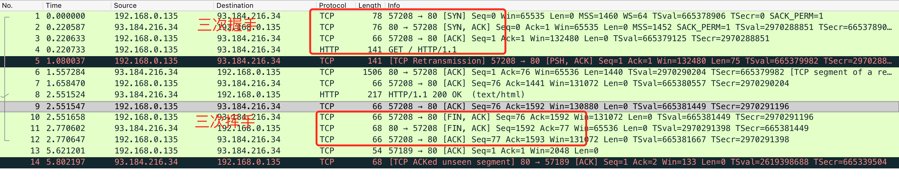
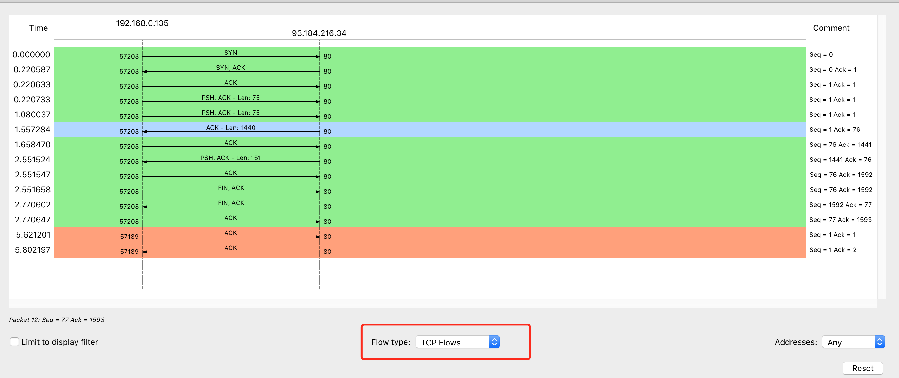
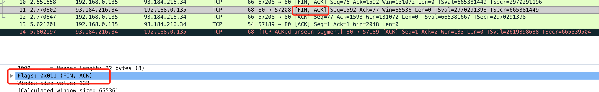
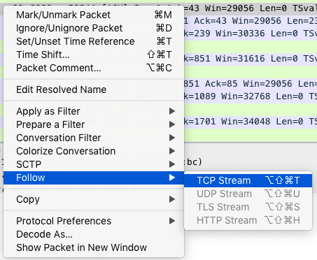

wireshark 可以导入 tcpdump 的抓包数据

<!--more-->

## 解析 HTTP 请求

以访问 http://example.com 为例

首先获取 IP

```shell
$ dig +short example.com
93.184.216.34
```

终端一运行:

```shell
$ tcpdump -nn host 93.184.216.34 -w web.pcap
```

终端二运行:

```shell
curl http://example.com
```

回到终端一，`ctrl+c`停止`tcpdump`
使用 `wireshark` 打开`web.pcap`文件



从菜单栏中，点击 Statistics -> Flow Graph，然后，在弹出的界面中的 Flow type 选择 TCP Flows，你可以更清晰的看到，整个过程中 TCP 流的执行过程：



对比 TCP 三次握手和四次挥手：


对比两张图，抓包数据挥手只有三次而不是四次，因为服务器端收到客户端的 FIN 后，服务器端同时也要关闭连接，**这样就可以把 ACK 和 FIN 合并到一起发送**，节省了一个包，变成了“三次挥手”。

合并操作可以通过点击查看：



## 过滤网络包

选中一个包，右键选择 “Follow” -> “TCP Stream”



然后再使用`Flow Graph`
