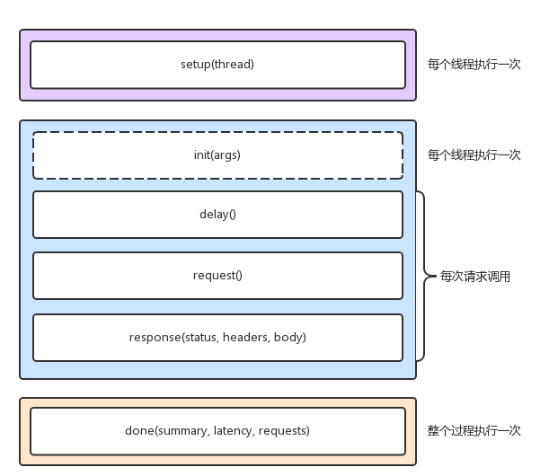

HTTP 性能测试工具，内置了 LuaJIT，方便你根据实际需求，生成所需的请求负载，或者自定义响应的处理方法。

<!--more-->

## 安装

```shell
$ git clone https://github.com/wg/wrk
$ cd wrk
$ apt-get install build-essential -y
$ make
$ sudo cp wrk /usr/local/bin/
```

## 测试

```shell
# -c表示并发连接数1000，-t表示线程数为2
$ ./wrk -c 1000 -t 2 http://172.18.9.134/
Running 10s test @ http://172.18.9.134/
  2 threads and 1000 connections
  Thread Stats   Avg      Stdev     Max   +/- Stdev
    Latency    30.91ms   93.67ms   1.93s    92.99%
    Req/Sec    24.52k     7.09k   36.22k    74.24%
  483652 requests in 10.06s, 396.19MB read
  Socket errors: connect 0, read 416, write 0, timeout 14
Requests/sec:  48096.13
Transfer/sec:     39.40MB
```

这里使用 2 个线程、并发 1000 连接，重新测试了 Nginx 的性能。可以看到，每秒请求数为 48096.13，吞吐量为 39.40MB，平均延迟为 30.01ms，比前面 ab 的测试结果要好很多。

这也说明，性能工具本身的性能，对性能测试也是至关重要的。不合适的性能工具，并不能准确测出应用程序的最佳性能。

wrk 最大的优势，是其内置的 LuaJIT，可以用来实现复杂场景的性能测试。

wrk 在调用 Lua 脚本时，可以将 HTTP 请求分为三个阶段，即 setup、running、done，如下图所示：



比如，你可以在 setup 阶段，为请求设置认证参数（来自于 wrk 官方示例）：

```shell

-- example script that demonstrates response handling and
-- retrieving an authentication token to set on all future
-- requests

token = nil
path  = "/authenticate"

request = function()
   return wrk.format("GET", path)
end

response = function(status, headers, body)
   if not token and status == 200 then
      token = headers["X-Token"]
      path  = "/resource"
      wrk.headers["X-Token"] = token
   end
end
```

执行时指定`lua 文件`

```shell
$ wrk -c 1000 -t 2 -s auth.lua http://172.18.9.134/
```

## 测试网络延迟

```shell
# 测试80端口性能
$ # wrk --latency -c 100 -t 2 --timeout 2 http://192.168.0.30/
Running 10s test @ http://192.168.0.30/
  2 threads and 100 connections
  Thread Stats   Avg      Stdev     Max   +/- Stdev
    Latency     9.19ms   12.32ms 319.61ms   97.80%
    Req/Sec     6.20k   426.80     8.25k    85.50%
  Latency Distribution
     50%    7.78ms
     75%    8.22ms
     90%    9.14ms
     99%   50.53ms
  123558 requests in 10.01s, 100.15MB read
Requests/sec:  12340.91
Transfer/sec:     10.00MB
```

## 测试指定时长

```shell
# 测试 30 分钟
$ wrk --latency -c 1000 -d 1800 http://192.168.0.30
```

